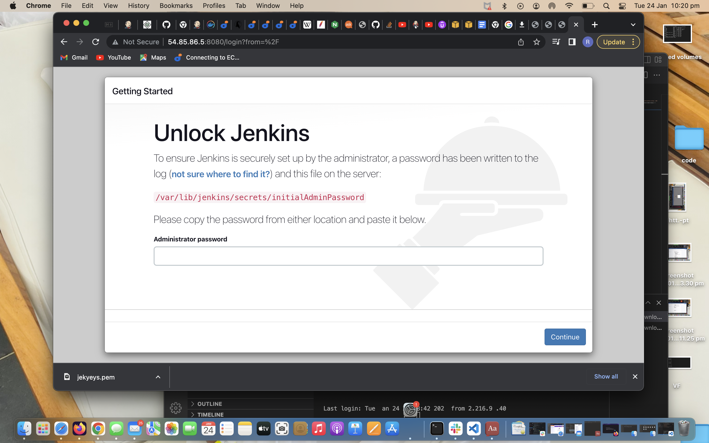
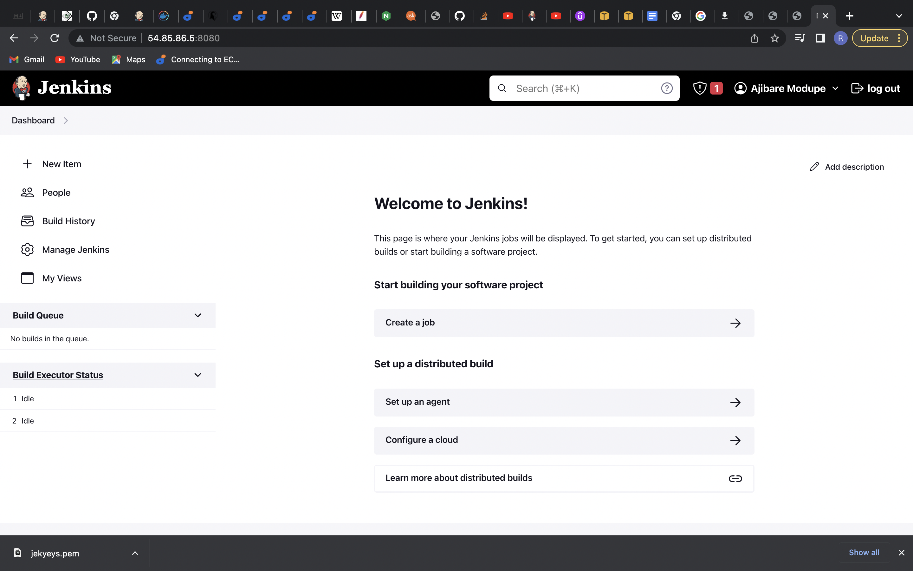
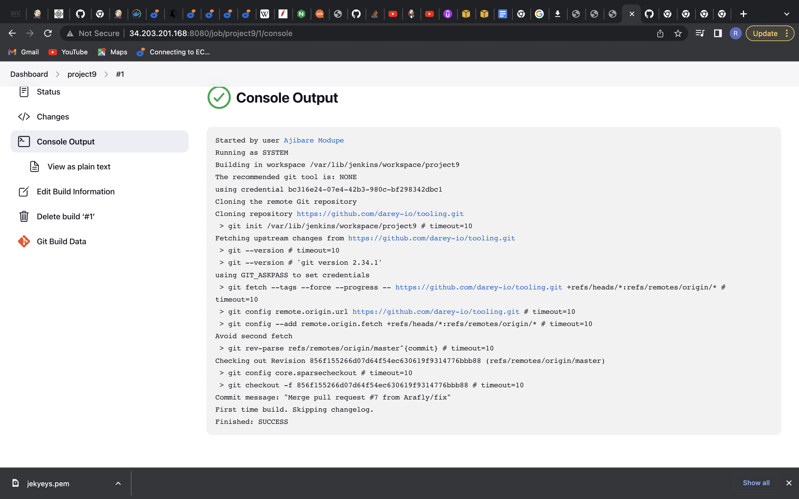
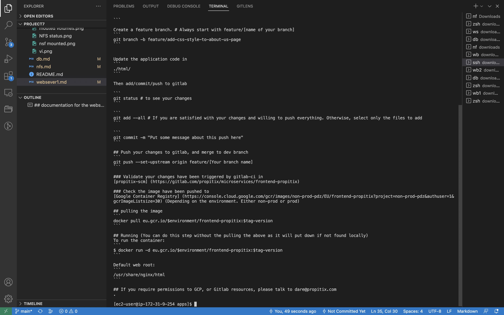

## Interesting documentation of project 9

`sudo apt update`

`sudo apt install default-jdk-headless`

``wget -q -O - https://pkg.jenkins.io/debian-stable/jenkins.io.key | sudo apt-key add -`
`sudo sh -c 'echo deb https://pkg.jenkins.io/debian-stable binary/ > \
    /etc/apt/sources.list.d/jenkins.list'`

`sudo apt update`

`sudo apt-get install jenkins`

`sudo systemctl status jenkins`

`sudo cat /var/lib/jenkins/secrets/initialAdminPassword`

